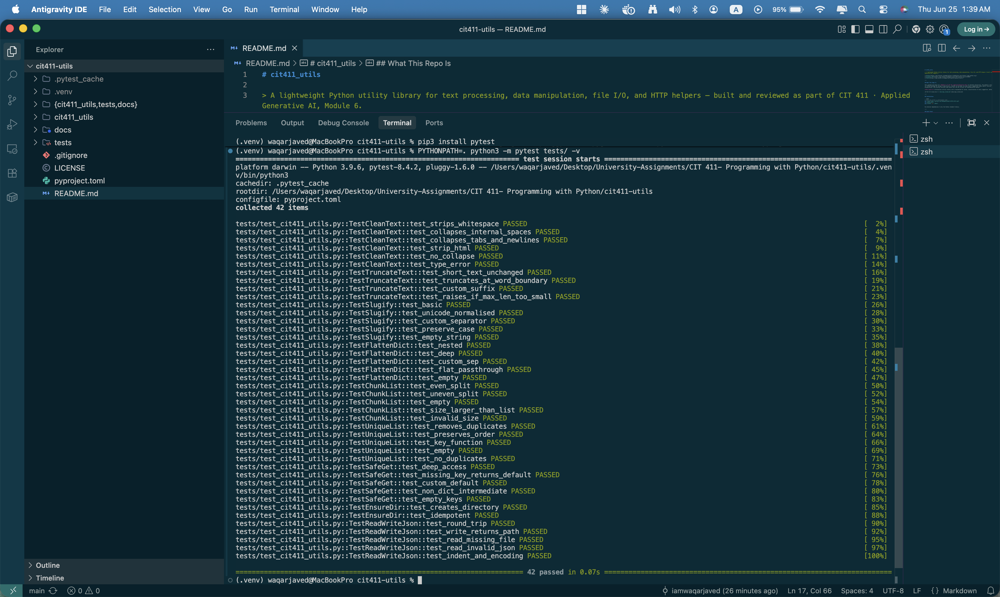

# cit411_utils

> A lightweight Python utility library for text processing, data manipulation, file I/O, and HTTP helpers — built and AI-reviewed as part of CIT 411 · Applied Generative AI, Module 6.

[](https://www.python.org/)
[](LICENSE)
[](tests/)
[]()
[]()

---

## What This Repo Is

This package was built for **Module 6 of CIT 411 (Applied Generative AI)** at Atlantis University. The module's focus: using AI as a *"fresh eyes"* reviewer for Python package API design — specifically, whether an AI model can make useful suggestions about public function names, parameter ordering, encapsulation, and missing functions when given only the API surface (no implementation bodies).

**The result:** An 11-function utility library with a fully documented AI review, classification of every suggestion, defended rejections, and adopted improvements — all visible in the commit history.

| File | Purpose |
|---|---|
| [`cit411_utils/`](cit411_utils/) | Package source — 4 modules, 11 public functions |
| [`tests/test_cit411_utils.py`](tests/test_cit411_utils.py) | 42 unit tests, all passing |
| [`docs/api_review.md`](docs/api_review.md) | Full AI review transcript, classification table, defended rejections |
| [`pyproject.toml`](pyproject.toml) | Build config, no external dependencies |

---

## Project Structure

```
cit411-utils/
├── README.md
├── LICENSE
├── .gitignore
├── pyproject.toml
├── cit411_utils/
│   ├── __init__.py         ← public exports
│   ├── text.py             ← clean_text, truncate_text, slugify
│   ├── data.py             ← flatten_dict, chunk_list, unique_list, safe_get
│   ├── files.py            ← read_json, write_json, ensure_dir
│   └── net.py              ← fetch_url (_parse_headers is private)
├── tests/
│   ├── conftest.py
│   └── test_cit411_utils.py
└── docs/
    └── api_review.md
```

---

## Installation

```bash
# Clone the repo
git clone https://github.com/iamwaqarjaved/cit411-utils.git
cd cit411-utils
```

**Install pytest and run tests (recommended for macOS/local):**

```bash
# Activate your virtual environment first if you have one
python3 -m venv .venv
source .venv/bin/activate       # macOS/Linux
# .venv\Scripts\activate        # Windows

pip3 install pytest
PYTHONPATH=. python3 -m pytest tests/ -v
```

> No external runtime dependencies — only the Python standard library is required.

---

## Running the Tests

### macOS / Linux

```bash
pip3 install pytest
PYTHONPATH=. python3 -m pytest tests/ -v
```

### Windows

```bash
pip install pytest
set PYTHONPATH=. && python -m pytest tests/ -v
```

### Test Results — 42 passed ✅



All 42 tests pass across 8 test classes covering every public function:

| Test Class | Tests | Covers |
|---|---|---|
| `TestCleanText` | 6 | `clean_text()` |
| `TestTruncateText` | 4 | `truncate_text()` |
| `TestSlugify` | 5 | `slugify()` |
| `TestFlattenDict` | 5 | `flatten_dict()` |
| `TestChunkList` | 5 | `chunk_list()` |
| `TestUniqueList` | 5 | `unique_list()` |
| `TestSafeGet` | 5 | `safe_get()` |
| `TestEnsureDir` | 2 | `ensure_dir()` |
| `TestReadWriteJson` | 5 | `read_json()`, `write_json()` |

---

## Quick Start

```python
from cit411_utils import (
    clean_text, truncate_text, slugify,
    flatten_dict, chunk_list, unique_list, safe_get,
    read_json, write_json, ensure_dir,
    fetch_url,
)
```

---

## API Reference

### 📝 Text — `cit411_utils.text`

#### `clean_text(text, *, strip_html=False, collapse_whitespace=True) → str`

Normalize a raw string: strip leading/trailing whitespace, collapse internal whitespace runs, and optionally remove HTML tags.

```python
from cit411_utils import clean_text

clean_text("  hello   world  ")
# → 'hello world'

clean_text("<p>Hello</p>", strip_html=True)
# → 'Hello'

clean_text("line1\nline2", collapse_whitespace=False)
# → 'line1\nline2'
```

> Raises `TypeError` if input is not a string.

---

#### `truncate_text(text, max_len, suffix="...") → str`

Shorten a string to `max_len` characters, breaking at word boundaries and appending `suffix`.

```python
from cit411_utils import truncate_text

truncate_text("Hello world, this is a long string", 14)
# → 'Hello world...'

truncate_text("Short", 20)
# → 'Short'  (unchanged, no suffix added)
```

> Raises `ValueError` if `max_len < len(suffix)`.

---

#### `slugify(text, separator="-", lowercase=True) → str`

Convert text to a URL-safe slug: normalise Unicode to ASCII, strip non-alphanumeric characters, replace spaces with `separator`.

```python
from cit411_utils import slugify

slugify("Hello World!")
# → 'hello-world'

slugify("Héllo Wörld")
# → 'hello-world'

slugify("My Article Title", separator="_", lowercase=False)
# → 'My_Article_Title'
```

---

### 🗂 Data — `cit411_utils.data`

#### `flatten_dict(d, *, sep=".") → dict`

Recursively flatten a nested dictionary, joining key paths with `sep`.

```python
from cit411_utils import flatten_dict

flatten_dict({"user": {"name": "Waqar", "address": {"city": "Miami"}}})
# → {'user.name': 'Waqar', 'user.address.city': 'Miami'}

flatten_dict({"a": {"b": 1}}, sep="/")
# → {'a/b': 1}
```

---

#### `chunk_list(items, size) → list[list]`

Split a list into successive sub-lists of length `size`. The final chunk may be shorter.

```python
from cit411_utils import chunk_list

chunk_list([1, 2, 3, 4, 5], 2)
# → [[1, 2], [3, 4], [5]]

chunk_list(range(6), 3)
# → [[0, 1, 2], [3, 4, 5]]
```

> Raises `ValueError` if `size < 1`.

---

#### `unique_list(items, *, key=None) → list`

Remove duplicates from a list while preserving insertion order.

```python
from cit411_utils import unique_list

unique_list([3, 1, 2, 1, 3])
# → [3, 1, 2]

unique_list(["Apple", "banana", "apple"], key=str.lower)
# → ['Apple', 'banana']
```

> **v1.1.0:** Renamed from `dedupe_list` — adopted from AI review (S-01). Aligns with `numpy.unique` / `pandas.Series.unique` naming conventions.

---

#### `safe_get(d, *keys, default=None) → any`

Safely traverse a nested dictionary. Returns `default` instead of raising `KeyError` when any key is missing.

```python
from cit411_utils import safe_get

profile = {"user": {"address": {"city": "Miami"}}}

safe_get(profile, "user", "address", "city")
# → 'Miami'

safe_get(profile, "user", "phone")
# → None

safe_get(profile, "user", "phone", default="N/A")
# → 'N/A'
```

> **v1.1.0:** New function — adopted from AI review (S-06). Pairs naturally with `flatten_dict()` for nested API response processing.

---

### 📁 Files — `cit411_utils.files`

#### `read_json(path) → dict | list`

Read and parse a JSON file with clear error messages.

```python
from cit411_utils import read_json

config = read_json("config.json")
print(config["version"])
```

> Raises `FileNotFoundError` if the path doesn't exist; `json.JSONDecodeError` if not valid JSON.

---

#### `write_json(data, path, *, indent=2, ensure_ascii=False) → pathlib.Path`

Serialise a Python object to a JSON file. Returns the resolved `Path` of the written file.

```python
from cit411_utils import write_json, ensure_dir

ensure_dir("output/data")
path = write_json({"status": "ok"}, "output/data/result.json")
print(path)
# → PosixPath('/absolute/path/to/output/data/result.json')
```

> **v1.1.0:** Return type updated from `None` → `pathlib.Path` — adopted from AI review (S-09). Mirrors `ensure_dir()` design for composability.
> Parent directories must exist — use `ensure_dir()` first.

---

#### `ensure_dir(path) → pathlib.Path`

Create a directory (and all missing parents) if it doesn't already exist. Safe to call repeatedly — equivalent to `mkdir -p`.

```python
from cit411_utils import ensure_dir

ensure_dir("output/reports/2026")
# → PosixPath('/absolute/path/to/output/reports/2026')
```

---

### 🌐 Net — `cit411_utils.net`

#### `fetch_url(url, *, timeout=10, retries=2, headers=None) → str`

Fetch the text body of a URL via HTTP GET, with automatic retry on transient failures.

```python
from cit411_utils import fetch_url

body = fetch_url("https://httpbin.org/get")
print(body[:80])

# With custom headers and timeout
body = fetch_url(
    "https://api.example.com/data",
    timeout=5,
    retries=3,
    headers={"User-Agent": "cit411/1.1"},
)
```

> Raises `urllib.error.URLError` after all retries are exhausted.

> **Note:** `parse_headers()` was made private (`_parse_headers`) in v1.1.0 — adopted from AI review (S-03). It supports `fetch_url` internally but has no standalone use case for callers.

---

## Module 6 — AI API Design Review

This package is the subject of a structured AI review exercise for CIT 411 Module 6. The AI (Claude) was given only the public API surface — no implementation bodies — and asked to review names, parameter ordering, encapsulation, and missing functions.

📄 Full review document → [`docs/api_review.md`](docs/api_review.md)

### AI Suggestion Classification (11 total)

| ID | Suggestion | Verdict | Outcome |
|---|---|---|---|
| S-01 | Rename `dedupe_list` → `unique_list()` | ✅ ACCEPT | Applied in v1.1.0 |
| S-02 | Merge `clean_text` + `truncate_text` | ❌ REJECT | Orthogonal responsibilities — violates SRP |
| S-03 | Make `parse_headers` private | ✅ ACCEPT | Applied in v1.1.0 |
| S-04 | Add `validate_email()` | ❌ REJECT | Out of scope — RFC compliance required |
| S-05 | Add `post_url()` counterpart | ⏸ DEPENDS | Deferred — no current use case |
| S-06 | Add `safe_get(d, *keys)` | ✅ ACCEPT | Applied in v1.1.0 |
| S-07 | Reverse `write_json(data, path)` order | ❌ REJECT | Follows `json.dump(obj, fp)` stdlib convention |
| S-08 | Narrow `read_json` return type | ⏸ DEPENDS | Deferred — revisit with more callers |
| S-09 | `write_json` return `Path` not `None` | ✅ ACCEPT | Applied in v1.1.0 |
| S-10 | Add `file_exists()` helper | ❌ REJECT | `pathlib.Path.exists()` already in stdlib |
| S-11 | Add `word_count()` | ⏸ DEPENDS | Deferred — marginal value |

### Key Finding

AI review is most useful on the first pass — it catches jargon (`dedupe` → `unique`) and encapsulation mistakes (`parse_headers` public) that a fatigued author misses. But it consistently over-suggests by reasoning from category ("text utils should have X") rather than from actual caller needs. Every suggestion requires a deliberate accept/reject decision — see the defended rejections in [`docs/api_review.md`](docs/api_review.md).

---

## Changelog

### v1.1.0 — Module 6 AI Review Revision
- ✅ Renamed `dedupe_list()` → `unique_list()` (S-01) — ecosystem alignment with numpy/pandas
- ✅ Added `safe_get(d, *keys, default=None)` (S-06) — safe nested dict traversal
- ✅ `write_json()` now returns `pathlib.Path` instead of `None` (S-09) — mirrors `ensure_dir()` design
- ✅ Made `parse_headers()` private as `_parse_headers()` (S-03) — internal HTTP detail only
- ✅ 42 unit tests added covering all public functions

### v1.0.0 — Initial Release
- `clean_text`, `truncate_text`, `slugify`
- `flatten_dict`, `chunk_list`, `dedupe_list`
- `read_json`, `write_json`, `ensure_dir`
- `fetch_url`, `parse_headers`

---

## Environment

Developed and tested on:

- **macOS** (Antigravity IDE) · Python 3.9.6 · pytest 8.4.2
- **Python 3.9+** compatible (no f-string walrus operators or 3.10+ syntax used)

---

## License

MIT — see [LICENSE](LICENSE).

---

## Author

**Waqar Javed** · [@iamwaqarjaved](https://github.com/iamwaqarjaved)
